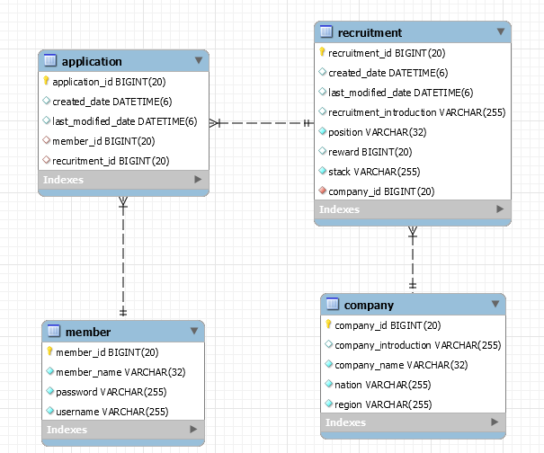

# wanted-pre-onboarding-backend

### 커밋 메세지 컨벤션
[Udacity Git Commit Message Style Guide](https://udacity.github.io/git-styleguide/)
### 코드 컨벤션
*네이버 코드 컨벤션*


## 서비스 개요
기업의 채용을 위한 웹 서비스
**회사**는 **채용공고**를 생성하고, 이에 **사용자**는 **지원**합니다.

### 엔티티
**회사, 채용공고, 사용자, 지원**

### ERD


## 요구사항
### 1. 회사는 채용 공고를 등록
채용공고에 필요한 정보들을 RequestBody로 DTO에 담는다. </p>
담은 정보를 바탕으로 Recruitment 객체 생성하고 Recruitment Table 에 저장</p>

*RecruitmentController*
```java
@PostMapping("/recruitment")
public ResponseEntity<CommonResponse> createRecruitment(@RequestBody RecruitmentRequest recruitmentRequest) {
return ResponseEntity.status(HttpStatus.CREATED.value()).body(new CommonResponse("채용 공고 생성 성공", 201, recruitmentService.createRecruitment(recruitmentRequest)));
}
```
### 2. 회사는 채용 공고를 수정
채용공고에서 회사ID를 제외한 정보 수정 가능</p>

*RecruitmentController*
```java
@PutMapping("/recruitments/{id}")
public ResponseEntity<CommonResponse> updateRecruitment(@PathVariable Long id, @RequestBody RecruitmentRequest recruitmentRequest) {
    return ResponseEntity.ok().body(new CommonResponse("채용 공고 수정 성공", 200, recruitmentService.updateRecruitment(id, recruitmentRequest)));
}
```
### 3. 회사는 채용 공고를 삭제
채용공고 DB에서 삭제</p>

*RecruitmentController*
```java
@DeleteMapping("/recruitments/{id}")
public ResponseEntity<CommonResponse> deleteRecruitment(@PathVariable Long id) {
    recruitmentService.deleteRecruitment(id);
    return ResponseEntity.ok().body(new CommonResponse("채용 공고 삭제 성공", 200));
}
```
### 4-1. 채용 공고 전체 목록 조회, 4-2. 사용자는 채용공고 검색 가능
사용자가 확인할 수 있는 채용공고 목록 조회</p>
search에 해당하는 검색어가 없는 경우 전체조회가 실행
search에 해당하는 검색어가 있는 경우 해당 키워드를 Company와 Recuritment의 Column들 전체에서 포함할 경우 반환


*RecruitmentController*
```java
    @GetMapping("/recruitments")
public ResponseEntity<CommonResponse> getRecruitmentSearch(@RequestParam(required = false) String search) {
        return ResponseEntity.ok().body(new CommonResponse("채용 공고 목록 조회 성공", 200, search == null ? recruitmentService.getRecruitments() : recruitmentService.getRecruitmentsWithCompanyIncludeKeyword(search)));
        }
```    
### 5. 채용 상세 페이지
채용 내용이 추가적으로 담겨 있음</p>
해당 회사가 올린 **현재 조회하고 있는 공고를 제외한** 다른 채용 공고 목록 추가

*RecruitmentController*
```java
    @GetMapping("/recruitments/{id}")
public ResponseEntity<CommonResponse> getRecruitment(@PathVariable Long id) {
        return ResponseEntity.ok().body(new CommonResponse("채용 공고 목록 조회 성공", 200, recruitmentService.getRecruitment(id)));
        }
```
### 6. 사용자는 채용공고에 지원
사용자는 1회만 지원 가능

*ApplicationController*
```java
@PostMapping("/application")
public ResponseEntity<CommonResponse> applyRecruitment(@RequestBody ApplicationRequest applicationRequest) {
        applicationService.applyRecruitment(applicationRequest);
        return ResponseEntity.ok().body(new CommonResponse("채용공고 지원 성공!", 200));
        }
```
## 요구사항 분석
 - 채용공고 CRUD
 - 지원 C
 - 채용공고에 대한 여러 컬럼에서의 sql 질의를 통한 키워드 조회 
 - 예시 데이터들의 형태를 보며 테이블 별로 어떤 컬럼을 사용할지 결정

## 구현 과정

- Entity 정의, DB 설계, Entity 작성,repository 생성, Controller-> Service -> 필요한 DTO 생성 순으로 구현 


## 필수 기술요건

- ORM 사용하여 구현.
- RDBMS 사용 (SQLite, PostgreSQL,MySql 등).

## 평가 요소

- 요구사항 구현정도
    - 모든 기능을 구현하지 않더라도 평가를 진행합니다.
- 모델링
- 코드 가독성 및 코드 컨벤션

## 기술점수 가산점 요소
**(제출시기 가산점과 달리 기술점수 5점 이내 포함되는 가산점 입니다.)**
- [X] 가산점이 포함된 요구사항 해결(요구사항 5~6)
- [ ] Unit Test 구현
- [X] README 에 요구사항 분석 및 구현 과정을 작성
- [X] Git commit 메시지 컨벤션

